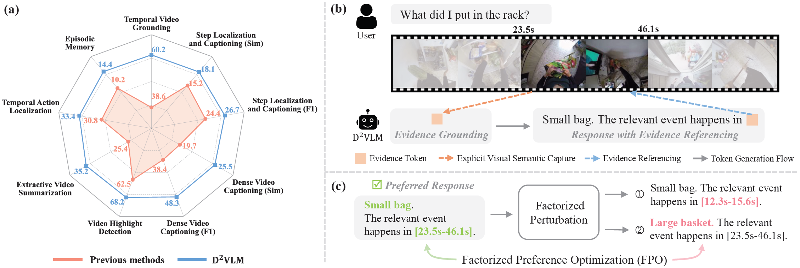

<p align="center">
  <h1 align="center">Factorized Learning for Temporally Grounded Video-Language Models</h1>
  <p align="center">
    <a href="https://wenzhengzeng.github.io/">Wenzheng Zeng</a><sup>1</sup>,
<!--     · -->
    <a href="https://scholar.google.com/citations?user=No9OsocAAAAJ&hl=en">Difei Gao</a><sup>1</sup>,
<!--     · -->
    <a href="https://scholar.google.com/citations?&user=h1-3lSoAAAAJ&hl=en">Mike Zheng Shou</a><sup>1</sup>,
<!--     · -->
    <a href="https://scholar.google.com/citations?user=FABZCeAAAAAJ&hl=en">Hwee Tou Ng</a><sup>1</sup>,
    
  </p>
  <p align="center"><sup>1</sup>National University of Singapore</p>
  <h3 align="center">ICCV 2025</h3>

  <!-- <h3 align="center"> <a href="https://wenzhengzeng.github.io/mpeblink/">Project Page</a> | <a href="https://arxiv.org/abs/2303.16053">Paper</a> | <a href="https://www.youtube.com/watch?v=ngME7dym0Uk">Video</a> | <a href="https://wenzhengzeng.github.io/mpeblink/static/images/cvpr23_poster.pdf">Poster</a> | <a href="https://zenodo.org/record/7754768">Dataset</a> | <a href="https://github.com/wenzhengzeng/MPEblink#-demo">Demo</a></h3>
    <h3 align="center"> <a href="https://paperswithcode.com/sota/on-mpeblink?p=real-time-multi-person-eyeblink-detection-in">
   -->
</a> </h3>
  <div align="center"></div>
</p>
<p align="center">
    
<!--    This repository contains the official implementation of the CVPR 2023 paper: "Real-time Multi-person Eyeblink Detection in the Wild for Untrimmed Video". <br> -->

<!--    The official implementation of the CVPR 2023 paper: "Real-time Multi-person Eyeblink Detection in the Wild for Untrimmed Video". -->
</p>
This repository contains the official implementation of the ICCV 2025 paper "Factorized Learning for Temporally Grounded Video-Language Models".

The camera-ready paper and the source code will be released soon.


<!-- ## 🎓 Citation

If you find our work useful in your research, please consider to cite our paper:

  ```
  @inproceedings{d2vlm,
    title={Factorized Learning for Temporally Grounded Video-Language Models},
    author={Zeng, Wenzheng and Gao, Difei and Shou, Mike Zheng and Ng, Hwee Tou},
    booktitle={Proceedings of the IEEE/CVF International Conference on Computer Vision (ICCV)},
    pages={13854--13863},
    year={2025}
  }
  ``` -->

